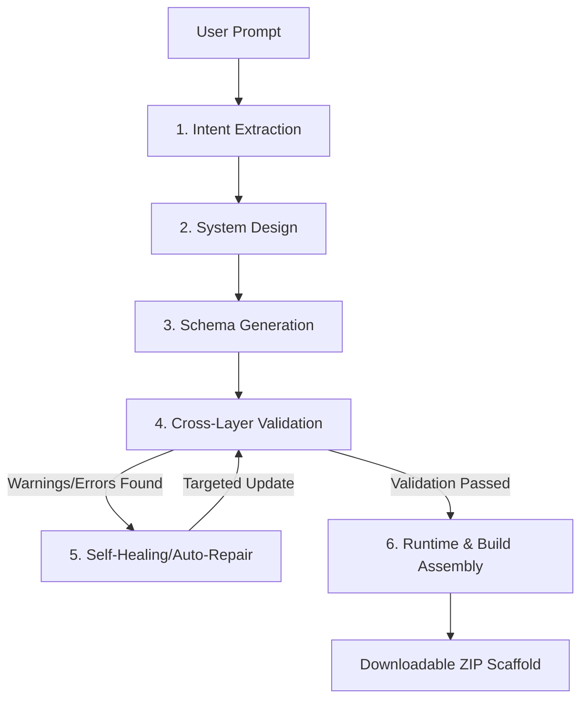

# 🤖 CompilerAI — Natural Language → Working Application

CompilerAI is a deterministic, production-ready **AI Software Compiler** that compiles high-level natural language prompts into fully structured, validated, and executable React (Frontend) + FastAPI (Backend) applications. 

Rather than generating code in a single "black-box" prompt, CompilerAI uses an isolated **6-stage pipeline** with cross-layer validation, automated self-healing loops, and a built-in evaluation framework to ensure reliability, predictability, and safety.

---

## 🌐 Live Demo

> **Deployed on Vercel** — Try it out without any local setup!

🔗 **[https://app-ai-compiler-bcsie3jf3-anshi-2004s-projects.vercel.app/](https://app-ai-compiler-bcsie3jf3-anshi-2004s-projects.vercel.app/)**

---

## 🏗️ 6-Stage Compilation Pipeline

The core compiler orchestrator manages the lifecycle of the prompt, streaming progression status in real-time to the UI via Server-Sent Events (SSE).



### 1. Intent Extraction (`IntentService`)
* Parses requirements to extract user roles, business rules, core entities, and features.
* Structures raw requirements into a predictable JSON intent tree.

### 2. System Design (`DesignService`)
* Decides on the technology stack, software components, service responsibilities, and connection routing.
* Generates a system architecture graph visualized in the frontend via node topology.

### 3. Schema Generation (`SchemaService`)
* Produces five discrete JSON schemas:
  - **UI Schema** (pages, routing paths, navigation, and roles).
  - **API Schema** (REST endpoints, methods, parameters, and I/O models).
  - **Database Schema** (tables, columns, primary/foreign keys, and indexes).
  - **Authentication Schema** (roles, scopes, tokens, and protection strategies).
  - **Business Logic Schema** (events, logic workflows, and condition checks).

### 4. Cross-Layer Validation (`ValidationService`)
Runs six independent validation suites checking:
* **JSON Integrity**: Correct types, non-empty structures, and key mappings.
* **UI/API Consistency**: Checks that pages point to existing backend routes.
* **API/DB Consistency**: Checks that input/output contracts map correctly to databases.
* **Database/Auth Integrity**: Validates naming conventions, primary keys, and index configurations.
* **Logical Safety**: Checks for circular dependencies, premium gates, and missing role access constraints.

### 5. Self-Healing/Auto-Repair (`RepairService`)
* If validation warnings or errors occur, the compiler triggers targeted repairs.
* **Targeted Regeneration**: The LLM is invoked only on the specific failing section (e.g., repairing database naming conventions or foreign keys) rather than restarting the entire prompt compilation, saving latency and token costs.

### 6. Runtime Assembly (`RuntimeService`)
* Scaffolds the database schemas, FastAPI routes, and React components.
* Validates python imports, structure, and bundle dependencies.
* Bundles all files into a downloadable ZIP archive containing a `Dockerfile` and setup instructions.

---

## 🛠️ Technology Stack & Tools

CompilerAI is built as a split-stack application:

| Layer | Technology | Usage / Purpose | File Location |
| :--- | :--- | :--- | :--- |
| **Backend Core** | **FastAPI** | High-performance async REST framework powering all compiler services and APIs. | `backend/app/main.py` |
| **Database ORM** | **SQLAlchemy** | Async engine (using `asyncpg` for Postgres/SQLite) to manage pipeline logs and evaluations. | `backend/app/database.py` |
| **LLM Interface** | **LangChain** | Integrations for OpenAI GPT models and Google Gemini APIs used during extraction and generation. | `backend/app/llm/` |
| **Database Migrations** | **Alembic** | Generates SQL schema structures and manages database migrations. | `backend/alembic/` |
| **Testing** | **Pytest** | Automated unit, API, and E2E integration verification suites. | `backend/tests/` |
| **PDF Reporting** | **fpdf2** | Dynamic layout generator used to compile detailed PDF performance and cost dashboards. | `backend/app/services/evaluation_service.py` |
| **Frontend Framework**| **Next.js 16** | Core react framework using the App Router for views, layouts, and page routing. | `frontend/app/` |
| **State Management** | **Zustand** | Light-weight client state engine managing pipeline steps, active runs, and theme variables. | `frontend/store/compilerStore.ts` |
| **Visual Flow Charts** | **React Flow** | Visual system topology component mapping backend database structures, routers, and frontend pages. | `frontend/components/` |
| **Code Editor** | **Monaco Editor** | Embedded text editor providing syntax highlighting for generated code views. | `frontend/app/(app)/` |
| **Theme System** | **Vanilla CSS + Tailwind** | Dynamic light/dark theme switcher hooked into CSS custom variables. | `frontend/app/globals.css` |
| **Infrastructure** | **Docker Compose**| Runs the database, backend services, and next.js web UI under isolated networks. | `./docker-compose.yml` |

---

## 📂 Project Directory Structure

```bash
AI ENGINEER/
├── backend/
│   ├── app/
│   │   ├── api/             # API Router endpoints (Intent, Design, Schema, etc.)
│   │   ├── core/            # Logging, custom exceptions, settings
│   │   ├── llm/             # LLM provider classes (OpenAI, Gemini)
│   │   ├── models/          # DB models (Runs, Repair logs, Evaluations)
│   │   ├── schemas/         # Pydantic schemas for request/response serialization
│   │   └── services/        # Orchestrator & core stage compilation logic
│   ├── storage/             # Generated projects, ZIP downloads, database file
│   ├── tests/               # Pytest suite
│   ├── Dockerfile
│   └── requirements.txt     # Python packages
├── frontend/
│   ├── app/                 # Next.js app directory pages and styles
│   ├── components/          # Shared elements, layouts, and visual flow elements
│   ├── features/            # Zustand stores and custom features
│   ├── store/               # Global state for theme and pipeline streams
│   ├── Dockerfile
│   └── package.json         # Node dependencies
└── docker-compose.yml       # Orchestrates PostgreSQL, backend, and frontend
```

---

## 🚀 Getting Started

### 1. Prerequisites
* **Docker & Docker Compose** (Recommended) OR
* **Python 3.12** and **Node.js 20+** (for manual local running)

### 2. Configure Environment Variables
Create a `.env` file in the `backend/` directory (or use `backend/.env.example` as a template):

```ini
APP_NAME=CompilerAI
APP_ENV=development
DEBUG=True

# LLM Configuration
LLM_PROVIDER=openai # or 'gemini'
LLM_MODEL=gpt-4o

# API Keys (Provide at least one based on LLM_PROVIDER choice)
OPENAI_API_KEY=your_openai_api_key_here
GOOGLE_API_KEY=your_google_api_key_here

# Database Configuration
# Uses local SQLite by default. Change to postgresql+asyncpg for PostgreSQL.
DATABASE_URL=sqlite+aiosqlite:///storage/compiler_ai.db
```

Ensure a similar environment file exists in the frontend `frontend/.env.local`:
```ini
NEXT_PUBLIC_API_BASE_URL=http://localhost:8000
```

---

## 🐳 Option A: Running with Docker Compose (Recommended)
From the root project directory, run:

```bash
docker compose build
docker compose up
```

This spins up:
* **Backend API** at [http://localhost:8000](http://localhost:8000)
* **Frontend Web App** at [http://localhost:3000](http://localhost:3000)
* **Swagger Documentation** at [http://localhost:8000/docs](http://localhost:8000/docs)

---

## 💻 Option B: Running Locally (Manual Setup)

### 1. Run the Backend API
1. Navigate to the backend directory:
   ```bash
   cd backend
   ```
2. Create and activate a virtual environment:
   ```bash
   python -m venv .venv
   # Windows:
   .\.venv\Scripts\activate
   # macOS/Linux:
   source .venv/bin/activate
   ```
3. Install dependencies:
   ```bash
   pip install -r requirements.txt
   ```
4. Run the API server:
   ```bash
   uvicorn app.main:app --host 127.0.0.1 --port 8000 --reload
   ```

### 2. Run the Frontend Web Application
1. Navigate to the frontend directory:
   ```bash
   cd frontend
   ```
2. Install Node packages:
   ```bash
   npm install
   ```
3. Start the Next.js development server:
   ```bash
   npm run dev
   ```
4. Open your browser and navigate to [http://localhost:3000](http://localhost:3000).

---

## 📊 Evaluation & Metrics Dashboard

CompilerAI has a built-in benchmark runner that automates evaluation across a dataset of **10 Product Prompts** (CRM, Library, LMS, Banking, Food Delivery, etc.) and **10 Edge Cases** (vague, impossible, conflicting, duplicate modules, missing auth requirements).

### Run Benchmarks:
1. Navigate to the **Evaluation** tab inside the dashboard.
2. Click **Run Benchmark**.
3. View real-time streaming progress logs as the compiler runs prompts, registers validation issues, triggers repairs, and saves metrics.
4. Review latency statistics, cost vs quality charts, and repair success rate dashboards.
5. Export performance reports as **CSV** or **PDF** directly from the UI.

### Run Automated Unit/Integration Tests:
```bash
cd backend
.\.venv\Scripts\pytest tests/
```
